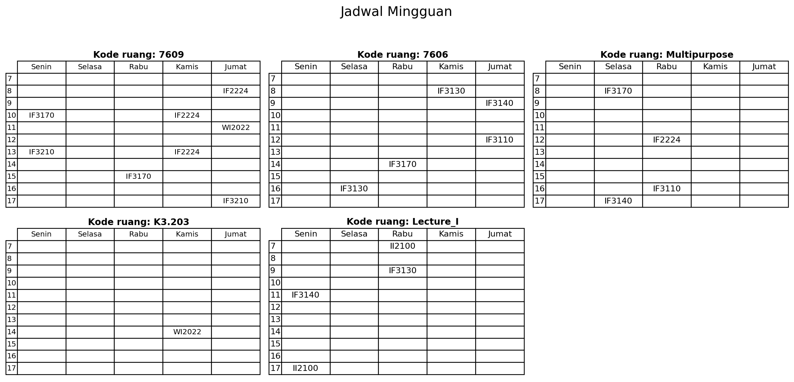
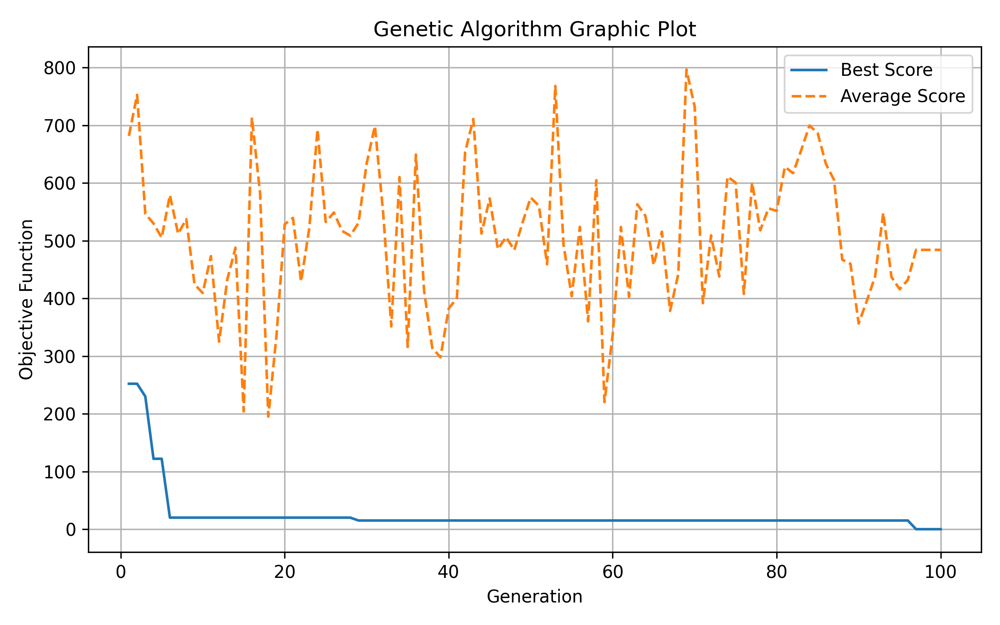

# Wumpus Enjoyer

Program ini digunakan untuk menjadwalkan kelas mingguan untuk sejumlah mata kuliah, ruangan, dan mahasiswa dengan berbagai batasan kapasitas serta jumlah SKS. Tujuan utama dari persoalan ini adalah menemukan jadwal yang optimal menggunakan algoritma Local Search, sehingga bentrokan antar jadwal dapat diminimalkan dan penggunaan sumber daya (ruangan dan waktu) menjadi efisien. Algoritma Local Search yang dipakai pada tugas besar ini meliputi Hill Climbing, Simulated Annealing, dan Genetic Algorithm.

---

## Daftar Isi
- [Struktur Folder](#struktur-folder)
- [Fitur Utama](#fitur-utama)
- [Cara Menjalankan](#cara-menjalankan)
- [Kontributor](#kontributor)

---

## Struktur Folder

```bash
└── wumpus-enjoyer/
    ├── input/
    │   ├── sample_input.json # json input
    │   └── jadwal_awal.png # visualisasi state awal
    ├── output /
    │   ├── ga/ # visualisasi ga
    │   ├── hc/ # visualisasi hc
    │   ├── sa/ # visualisasi sa
    │   └── jadwal_final.png # visualisasi 
    ├── src/
    │   ├── algorithm/
    │   │   ├── __init__.py
    │   │   ├── genetic_algorithm.py
    │   │   ├── hill_climbing.py
    │   │   └── simulated_annealing.py
    │   ├── utils/
    │   │   ├── __init__.py
    │   │   ├── GA_utils.py
    │   │   ├── objective.py
    │   │   ├── plotter.py
    │   │   ├── state.py
    │   │   └── visualize_timetable.py
    │   ├── __init__.py
    │   └── main.py
    ├── .gitignore
    ├── LICENSE
    ├── README.md
    └── requirements.txt
```

---

## Fitur Utama
### Input
Input berupa file .json yang berisi data mata kuliah, ruangan, dan mahasiswa. Mata kuliah memiliki atribut kode, nama, jumlah mahasiswa, dan sks. Ruangan memiliki atribut kode dan kuota. Mahasiswa memiliki atribut nim, daftar mk dalam array, dan prioritas mata kuliah. Berikut adalah contoh input.json

```bash
{
    "kelas_mata_kuliah": [
        {
        "kode": "IF3071_K01",
        "jumlah_mahasiswa": 60,
        "sks": 3
        },
        {
        "kode": "IF3130_K01",
        "jumlah_mahasiswa": 45,
        "sks": 2
        },
        {
        "kode": "IF3110_K02",
        "jumlah_mahasiswa": 70,
        "sks": 3
        },
        {
        "kode": "IF3140_K01",
        "jumlah_mahasiswa": 55,
        "sks": 2
        }
    ],

    "ruangan": [
        {
        "kode": "7609",
        "kuota": 60
        },
        {
        "kode": "7606",
        "kuota": 80
        },
        {
        "kode": "multimedia",
        "kuota": 40
        }
    ],

    "mahasiswa": [
        {
        "nim": "13523601",
        "daftar_mk": ["IF3071_K01", "IF3130_K01"],
        "prioritas": [1, 2]
        },
        {
        "nim": "135236641",
        "daftar_mk": ["IF3110_K02", "IF3130_K01"],
        "prioritas": [1, 2]
        },
        {
        "nim": "13523669",
        "daftar_mk": ["IF3140_K01", "IF3071_K01"],
        "prioritas": [1, 2]
        },
        {
        "nim": "13523600",
        "daftar_mk": ["IF3110_K02"],
        "prioritas": [1]
        }
    ]
}
```

### Pilihan Algoritma 
1. Hill Climbing Steepest Ascent
2. Hill Climbing With Sideways Move
3. Hill Climbing Random Restart 
4. Stochastic Hill Climbing
5. Simulated Annealing
6. Genetic Algorithm

### Output
Output berupa tampilan state akhir dalam rupa timetable jadwal, yang mana sumbu X berupa hari senin - jumat, dan sumbu Y berupa jam 7 hingga 17. Isi dari timetable adalah kode mata kuliah. Setiap algoritma juga menghasilkan visualisasi plotting sesuai dengan kriteria masing-masing algoritma. Berikut adalah contoh output.



---

## Cara Menjalankan
### 1. Clone repository
```bash
git clone https://github.com/andrewtedja/wumpus-enjoyer.git
cd wumpus-enjoyer
```

### 2. Setup environment

Note: Kalau pertama kali menjalankan di local, lakukan
```bash
python -m venv venv
```
Pertama, masuk ke virtual environment terlebih dahulu.
```bash
source venv/bin/activate
```

### 3. Install dependencies (Kalau pertama kali menjalankan)

```bash
pip install -r requirements.txt
```

### 4. Jalankan program

```bash
python src/main.py
```

Hasil dapat dilihat di folder output.

---

## Kontributor
| NIM          | Nama                      | Tugas dan Kontribusi                                                                                                                                                                                                                                          |
| ------------ | ------------------------- | ------------------------------------------------------------------------------------------------------------------------------------------------------------------------------------------------------------------------------------------------------------- |
| **13523148** | **Andrew Tedjapratama**   | • Setup initialization, arsitektur kode, dan integrasi program.<br>• Pembuatan representasi state dan visualisasi tabel.<br>• Pembuatan sistem *objective function*.<br>• Implementasi algoritma *Simulated Annealing*.<br>• Mengerjakan testing dan laporan. |
| **13523141** | **Jovandra Otniel P. S.** | • Implementasi algoritma *Hill Climbing* dan seluruh variasinya (*bonus*) beserta visualisasi.<br>• Membantu pengerjaan *objective function* dan implementasi *move/swap*.<br>• Mengerjakan testing dan laporan.                                              |
| **13523154** | **Theo Kurniady**         | • Implementasi algoritma *Genetic Algorithm* beserta visualisasi.<br>• Melakukan testing.<br>• Membuat dokumentasi README.md.<br>• Mengerjakan testing dan laporan.                                                                                         |
